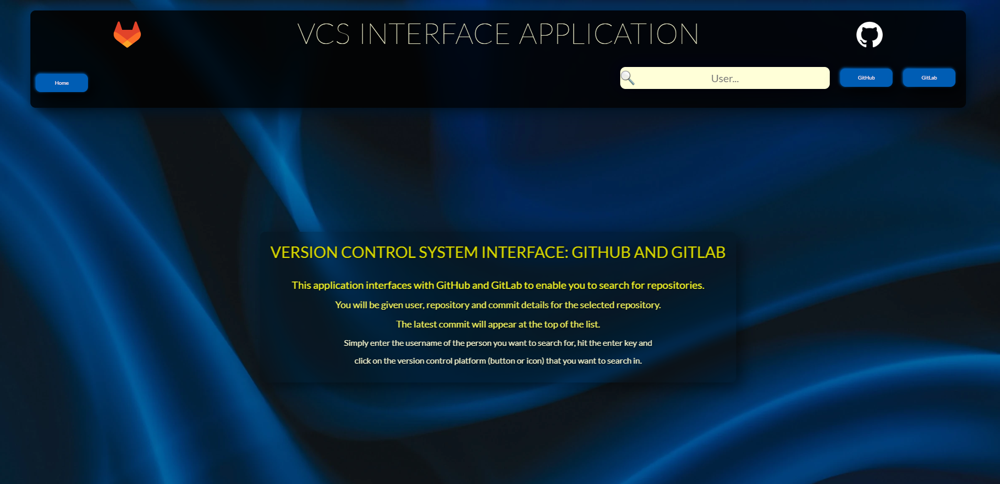
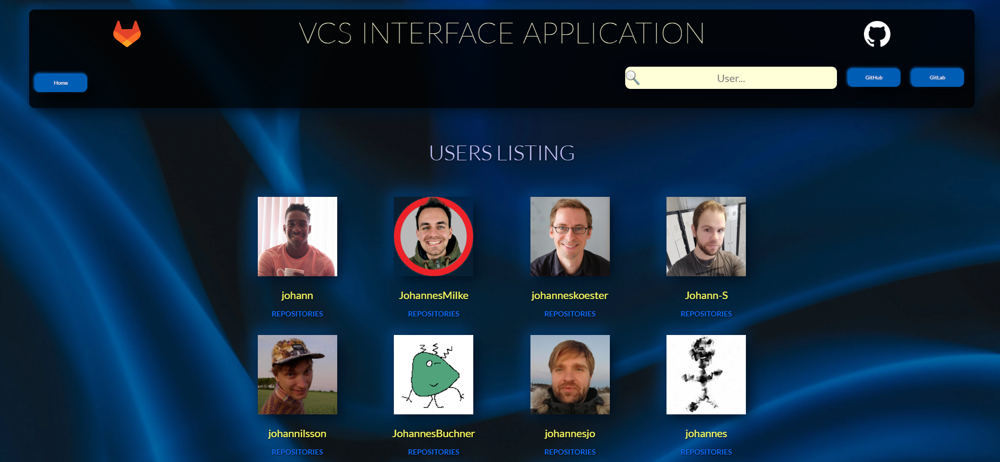
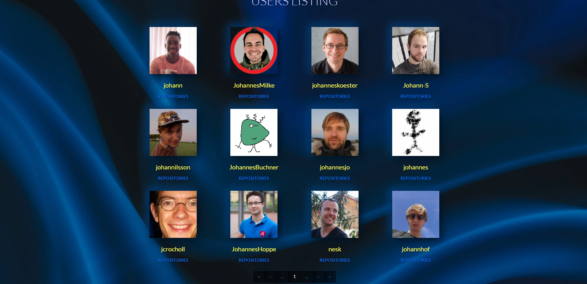
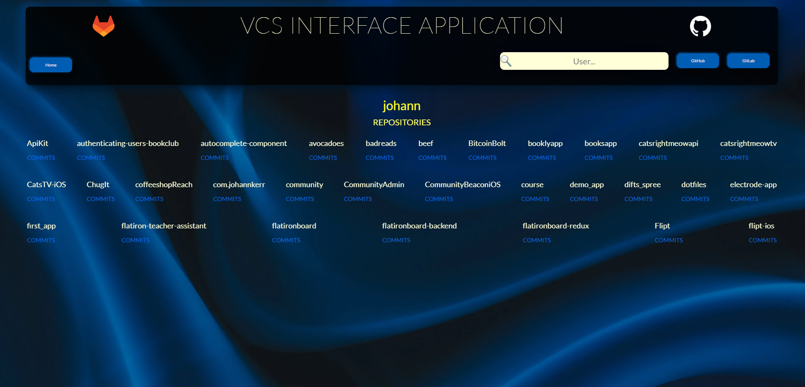
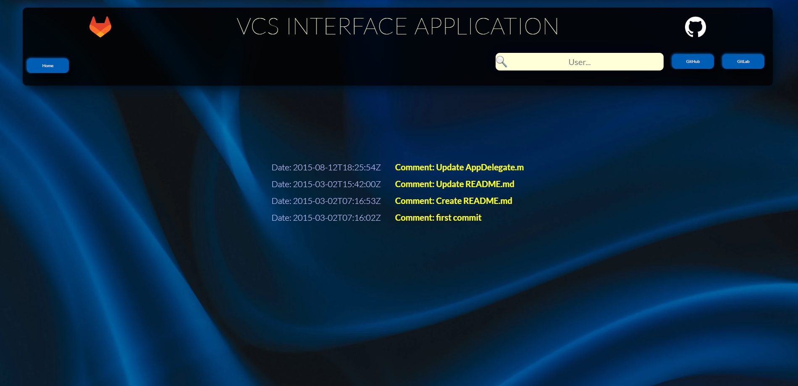

# Version Control Systems Application v1.0.0  - Under Construction

## Index

1. Introduction
2. Installation
3. Usage
4. Credits and Versioning

### 1. Introduction

This is a full stack web application that interfaces with two VCS providers via RESTful APIs. It works very well with GitHub where access to public repos are easily obtained by the use of a private token. The GitLab interface, however, produces users as expected, but their repositories seems to be private by default because the web links to the users show empty repository links when viewed publicly. This is important to keep in mind when using the application. All task specification, however, have been adhered to where both VCS providers are concerned.  

Because the structure of the two RESTful APIs are so different the handling of the two VCS suppliers are kept separate and contained. This was done to simplify the codebase. The downside to this approach is that there is a fair amount of duplication.  

It is hoped that you enjoy interacting with this application and that it is found to be useful.  

### 2. Installation

The App in its development phase is very easy to install. It is just a question of installing all the required dependencies. So change first into the `backend` subfolder and then into the `frontend` folder before running the command `yarn install` in the terminal inside the two subfolders respectively. For those still using npm, the process  is exactly the same except that the command is `npm install`.  

### 3. Usage

Once installed simply open two terminals change into the backend and frontend folders separately and run the `yarn start` or `npm start` command. This will start the frontend of the React application as well as the server on the backend. The React application should open automatically in your browser.  

It is then very easy to use the application. You will be greeted by a home page with instructions:  

You simply enter the user name for which you want to run a search and click on the respective icons or buttons for the two VCS providers. You will be presented with a page that displays different users with a navigation bar at the bottom that will allow you to traverse the different pages of results returned. There are unfortunately limits on the number of user that can be downloaded so it is currently set on 144 at a time. The success of your results will depend on the accuracy of the user name used in the search.  

  

Once on the users listing page you can click on the user's avatar or name to take you to their public profile on the VCS providers' sites. You can also click on the "repositories" link that will take you to their respective lists of repositories.

The repository page has links to a list of commits for each repository. You can also click on the user name from here and it will take you to the user's VCS public web url as above:  

Finally, when you click on the commits links on the repositories page, you will be greeted by the respective repos' commits. The commits will appear in descending order with the latest commit appearing at the top of the list:  

### 4. Credits and Versioning

This application was designed and written by Johann Jansen van Vuuren. The latest release is version 1.0.0 which was released on 6 May 2023.  

This project was bootstrapped with [Create React App](https://github.com/facebook/create-react-app).

### Available Scripts

#### `yarn start`

Runs the app in the development mode. It has to be used in both the backend and frontend folders of the project to start both ends of the project.  

#### `yarn test`

Launches the test runner in the interactive watch mode. Please make sure you are in the respective backend or frontend folders before running this script because the test suites run seperately for the two.  

### Learn More

You can learn more in the [Create React App documentation](https://facebook.github.io/create-react-app/docs/getting-started).

To learn React, check out the [React documentation](https://reactjs.org/).

